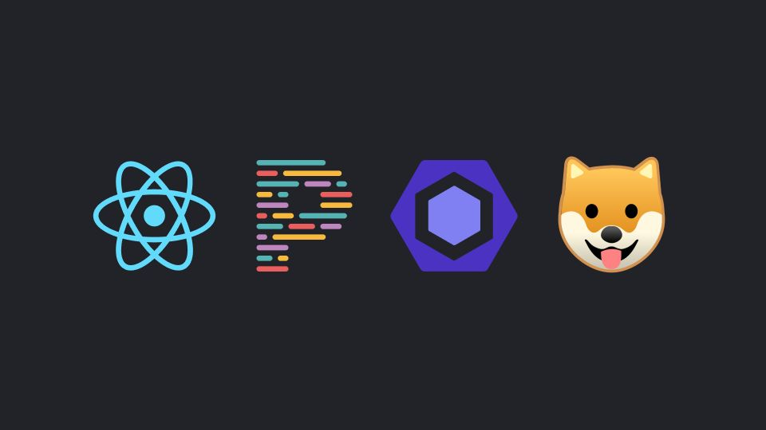

# Husky + Prettier Boilerplate (Node.js)



Working on a project with Git and GitHub is relatively simple. When a project starts to grow however, it is crucial to write clean code that other developers can read. Follow this
article to learn how to set up linting and pre-commit hooks for your repository.

Let’s walk through the steps for a one-time setup to configure [husky](https://github.com/typicode/husky) pre-commit and pre-push hooks, [ESLint](https://eslint.org/) with code
styles conventions, [prettier](https://prettier.io/) code formatter, and [lint-staged](https://github.com/okonet/lint-staged). Husky automatically runs a script on each commit or
push. This is useful for linting files to enforce code styles that keeps the entire code base following conventions.

## Walkthrough

Install the dependencies:

```
npm install husky@4.3.8 lint-staged@10.5.4 prettier@2.8.8 --save-dev
```

```
yarn add husky@4.3.8 lint-staged@10.5.4 prettier@2.8.8 --dev
```

### Package.json Updates

Add the following to your `package.json` to configure all three packages:

```json
{
  "name": "@spencer/example-package",
  // ...
  "scripts": {
    "format": "prettier --write ."
  },
  "prettier": {
    "printWidth": 180,
    "tabWidth": 2,
    "singleQuote": true,
    "semi": true,
    "trailingComma": "es5",
    "bracketSpacing": true,
    "arrowParens": "avoid",
    "proseWrap": "always",
    "requirePragma": false,
    "insertPragma": false,
    "endOfLine": "lf",
    "jsxBracketSameLine": true
  },
  "husky": {
    "hooks": {
      "pre-commit": "lint-staged"
    }
  },
  "lint-staged": {
    "*.{js,jsx,ts,tsx,json,css,md}": ["prettier --write"]
  }
}
```

### Configure ESLint (optional)

First, install this package

```
npm install eslint-config-prettier
```

Then, run `npm init @eslint/config` to create a config file and choose preferred code styles.

Alternatively, use this example file. In the root directory, create `.eslintrc`:

```json
{
  "extends": ["eslint:recommended"],
  "plugins": ["prettier"],
  "parserOptions": {
    "ecmaVersion": 2017
  },
  "env": {
    "es6": true
  },
  "rules": {
    "no-console": "off",
    "no-unused-vars": "off",
    "react/prop-types": "off",
    "quotes": [
      2,
      "double",
      {
        "avoidEscape": true
      }
    ]
  }
}
```

## Everything in action

After making changes, commit the files, and see `lint-staged` automatically run, triggered by the pre-commit hook.

```sh
my-project$ git commit -m 'example commit message'
✔ Preparing lint-staged...
✔ Running tasks for staged files...
✔ Applying modifications from tasks...
✔ Cleaning up temporary files...
[example-branch 4bc4030] add new husky setup
 4 files changed, 59 insertions(+), 44 deletions(-)
```

All files have been linted and automatically fixed with `prettier`, or denied if too many errors were thrown. Now we can push the "clean" code.

```sh
my-project$ git push origin example-branch
# npx lint-staged
# ... (no errors found)
# npm test
# ... (PASS)
Enumerating objects: 7, done.
Counting objects: 100% (7/7), done.
Delta compression using up to 8 threads
Compressing objects: 100% (4/4), done.
Writing objects: 100% (4/4), 375 bytes | 375.00 KiB/s, done.
Total 4 (delta 3), reused 0 (delta 0), pack-reused 0
remote: Resolving deltas: 100% (3/3), completed with 3 local objects.
To https://github.com/spencerlepine/my-project.git
   4bc4030..b558038  example-branch -> example-branch
```

## Boilerplate

See a working example here: [GitHub repository](https://github.com/spencerlepine/husky-boilerplate).

## Notes

A useful trick is the `-–no-verify` flag to SKIP the pre-commit or pre-push hook. Use this option to skip the husky script in case you force a commit/push.

```sh
my-project$ git push origin my-branch --no-verify
# husky will not run "npm test"
... pushing to GitHub
```

When `husky` released v7, it had some major changes to the configuration. There are many articles and Stack Overflow answers about husky, but some of them are misleading if they
were using v4.

Hope this article helped! Interested in more, check out more articles [here](https://spencerlepine.github.io/blog).
